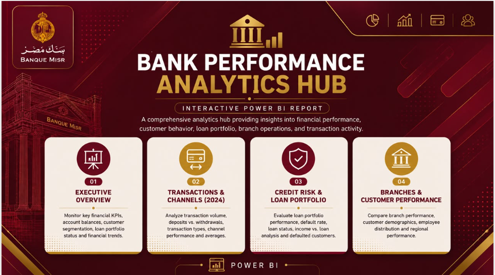
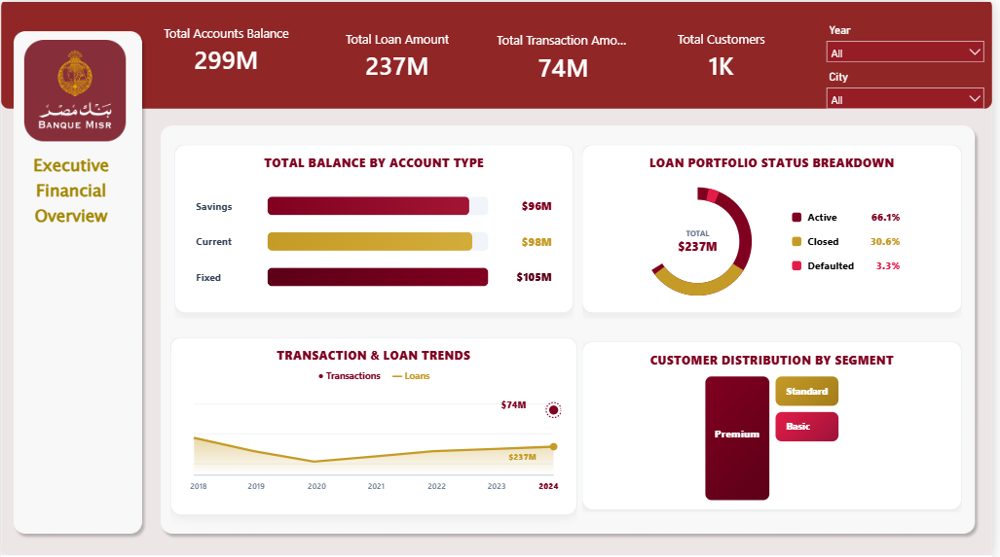
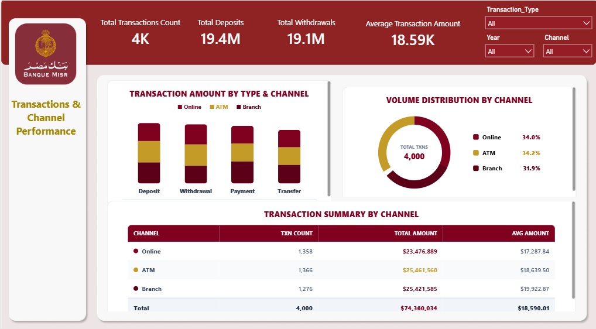
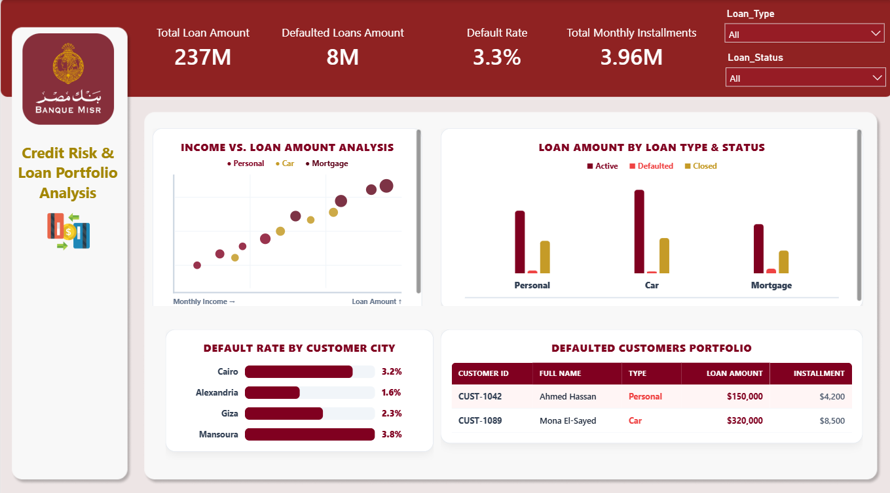
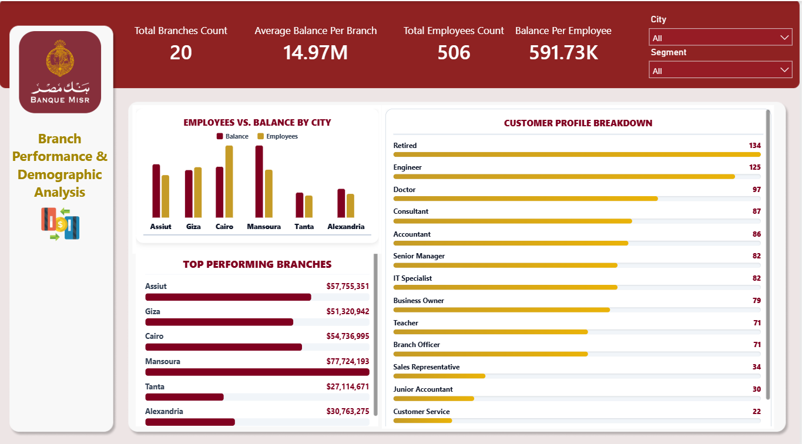
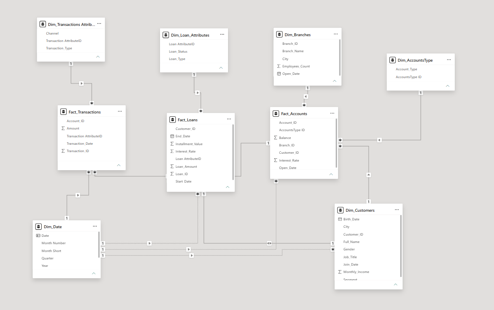

# 🏦 Bank Performance Analytics Hub

## 📌 Project Overview

This repository contains an interactive **4-page Power BI Analytics Hub** designed to analyze banking performance and support data-driven decision-making.

The project combines historical banking data with **2024 transaction analysis**, delivering insights into financial performance, customer behavior, loan portfolio, and branch operations.

---

## 📄 Report Pages

### 1️⃣ Cover Page

---

### 2️⃣ Executive Overview

---

### 3️⃣ Transactions & Channels (2024)

---

### 4️⃣ Credit Risk & Loan Portfolio

---

### 5️⃣ Branches & Customer Performance

---

## 🗂️ Data Model

---

## 🛠️ Tools & Technologies

- Power BI
- Power Query
- DAX
- Data Modeling
- Star Schema

---

## 📊 Key Features

- Executive KPI Monitoring
- Financial Performance Analysis
- 2024 Transaction Analysis
- Loan Portfolio Monitoring
- Credit Risk Analysis
- Branch Performance Analysis
- Customer Segmentation
- Interactive Slicers & Drill-down

---

## 💡 Business Insights

- Savings accounts contribute the highest account balances.
- Most loans remain active with a relatively low default rate.
- Transaction analysis for **2024** shows balanced cash flow between deposits and withdrawals.
- Branch performance varies across cities, highlighting opportunities for operational improvement.
- Customer segmentation supports more targeted business strategies.

---

## 📁 Repository Contents

- `BANK.pbix` → Power BI report
- `Data_model.png` → Star Schema Data Model
- `1.png` → Cover Page
- `2.png` → Executive Overview
- `3.png` → Transactions & Channels
- `4.png` → Credit Risk & Loan Portfolio
- `5.png` → Branches & Customer Performance
